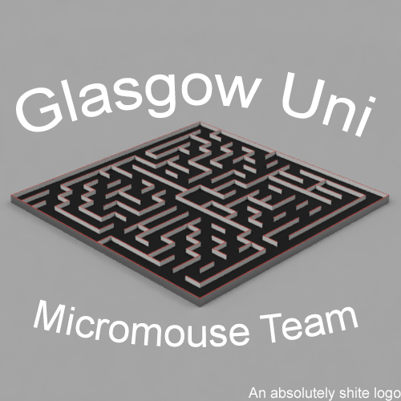

# Micromouse 

This is the page for source of the Glasgow Uni Micromouse Team 2018 project.

## The hardware

The hardware consists of a Mbed Microcontroller (Mbed LPC 1768) and a Motor Driver (L298N)

## The software

The software is in the very early development stages.
We are currently working on the hardware interface layer.